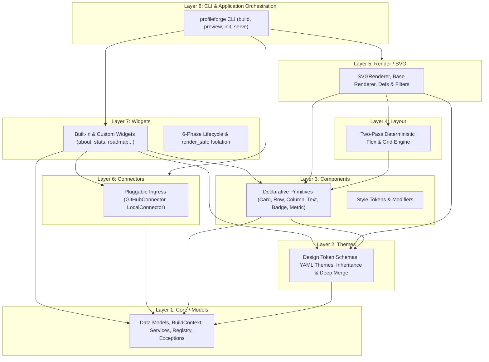
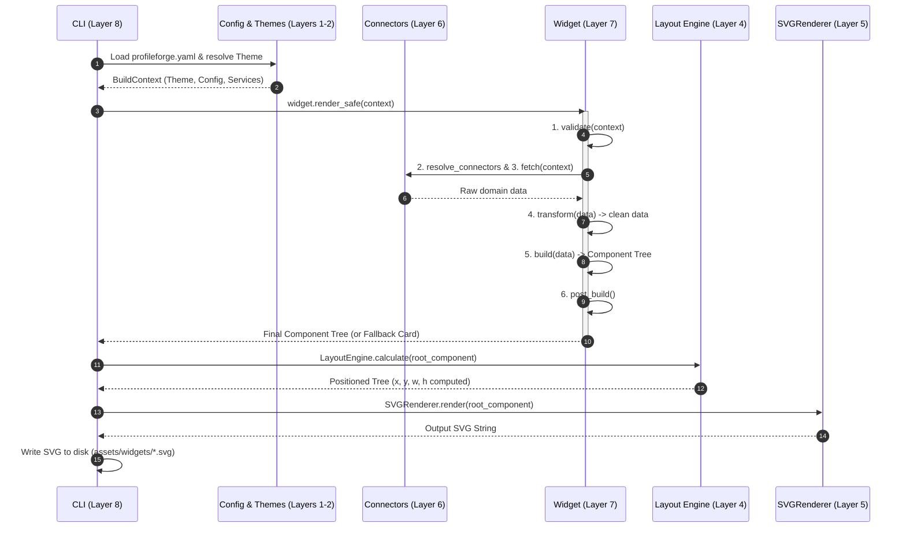

# ProfileForge Architecture Specification

## 1. Executive Summary & Design Philosophy

ProfileForge is an open-source, developer-centric engine that generates dynamic, theme-aware, and highly aesthetic GitHub profile assets and SVG dashboards.

To maintain long-term stability, extensibility, and maintainability across a global open-source community, ProfileForge enforces **strict layer encapsulation**, a **declarative component model**, and an **immutable layer boundary contract**.

### Core Architecture Invariants
1. **Zero External Browser Runtime**: ProfileForge does not require Chromium, Puppeteer, Cairo, or Node.js. All SVG generation is 100% pure Python and deterministic.
2. **Declarative UI Composition**: Widgets do not manipulate SVG strings. They assemble declarative `Component` trees styled via design tokens.
3. **Deterministic Two-Pass Layout**: Layout coordinates `(x, y, width, height)` are mathematically computed before passing to renderers.
4. **Fault Isolation**: A failure in one widget or connector (e.g. GitHub API rate limits, missing local files) never crashes profile generation.
5. **Frozen API Surface**: Core layers are protected by an automated API Snapshot Lock (`tools/api_lock.py`). Breaking changes require a formal Request for Comments (RFC).

---

## 2. Layer Architecture & Boundaries

ProfileForge is strictly organized into **8 architectural layers**. Dependency flow is strictly **unidirectional (downward)**: higher layers may depend on lower layers, but lower layers must never import or depend on higher layers.



---

## 3. Layer Specifications & Responsibilities

### Layer 1: Core / Models (`profileforge.core`)
- **Responsibilities**:
  - Foundational data structures (`Theme`, `ColorTokens`, `TypographyTokens`, `SpacingTokens`, `RadiusTokens`, `ShadowTokens`, `MotionTokens`, `EffectsTokens`, `ProfileForgeConfig`, `WidgetConfig`, `Outputs`, `DataRequest`).
  - Execution context encapsulation (`BuildContext`, `Services`).
  - Global registries (`WIDGET_REGISTRY`, `register_widget`).
  - Base exceptions (`ProfileForgeError`, `ConfigurationError`, `ThemeError`, `RenderError`, `ConnectorError`).
- **Input / Output**: Ingests raw configurations; outputs strongly typed immutable dataclasses.
- **Constraints**: **Zero dependencies** on higher layers.

### Layer 2: Themes (`profileforge.themes`, `profileforge.core.config`)
- **Responsibilities**:
  - Structured design token definitions adhering to the ProfileForge design system.
  - Built-in theme definitions (`github-dark`, `github-light`, `catppuccin-*`, `dracula`, `nord`, `apple`, `vercel`, `showcase`, `minimal`, `modern`).
  - Single-inheritance resolution (`extends:`), deep dictionary merging, and cyclic dependency detection.
- **Constraints**: Must only reference Layer 1 models. Cannot import layout, components, or renderers.

### Layer 3: Components (`profileforge.components`)
- **Responsibilities**:
  - Declarative UI component primitives.
  - **Structural Components**: `Row`, `Column`, `Padding`, `Spacer`, `Wrap`.
  - **Visual Components**: `Card`, `Text`, `Badge`, `Icon`, `ProgressBar`, `Metric`, `MetricGroup`, `CircularMetric`.
  - **Styling**: `Style` dataclass supporting semantic token mapping, margins, padding, radii, elevation, and flex alignments (`start`, `center`, `end`).
- **Constraints**: Components are pure data structures holding children and computed dimensions. They execute no I/O, no network calls, and no direct string rendering.

### Layer 4: Layout (`profileforge.render.layout`)
- **Responsibilities**:
  - Deterministic two-pass layout calculation for SVGs.
  - **Pass 1 (Measurement)**: Measures intrinsic widths/heights and resolves relative sizing (`fill`, `auto`).
  - **Pass 2 (Positioning)**: Computes absolute `(computed_x, computed_y)` coordinates, handles flex alignments (cross-axis and main-axis), computes wrap row breaks, and shifts nested subtrees.
- **Constraints**: Layout calculation is completely decoupled from visual XML rendering.

### Layer 5: Render / SVG (`profileforge.render`)
- **Responsibilities**:
  - Visual output synthesis (`Renderer` base class, `SVGRenderer`).
  - Converts positioned `Component` trees into valid, standards-compliant, and sanitized SVG XML.
  - Generates SVG `<defs>` including linear gradients, drop shadow filters (`feDropShadow`), glow filters (`feGaussianBlur`), clip paths, and font styling.
  - Ensures complete compatibility with GitHub Markdown dark and light themes.
- **Constraints**: Consumes positioned components; does not perform business logic or fetch remote data.

### Layer 6: Connectors (`profileforge.connectors`)
- **Responsibilities**:
  - Pluggable data ingress interface (`Connector` base class).
  - Built-in connectors: `GitHubConnector` (GraphQL / REST with caching, pagination, rate-limit defense, and personal access token authentication) and `LocalConnector` (safe local JSON/YAML file parsing).
  - Encapsulates authentication, secrets management, and offline cache fallbacks.
- **Constraints**: Must return normalized dictionaries or primitives. Cannot produce UI components.

### Layer 7: Widgets (`profileforge.widgets`)
- **Responsibilities**:
  - High-level modular feature blocks that transform connector data into declarative `Component` trees.
  - **Strict 6-Phase Lifecycle**:
    1. `validate(context)`: Verifies prerequisites and configurations.
    2. `resolve_connectors(context)`: Resolves required data sources.
    3. `fetch(context)`: Performs non-blocking I/O retrieval.
    4. `transform(raw_data, context)`: Cleans and aggregates domain data.
    5. `build(data, context)`: Constructs declarative `Component` tree.
    6. `post_build(component, context)`: Applies final wrapping or styling adjustments.
  - **Failure Isolation (`render_safe`)**: Catches all exceptions and outputs an informative fallback diagnostic `Card` without failing the overall build pipeline.
- **Constraints**: Must subclass `Widget`, implement `metadata() -> WidgetMetadata`, and use only Layer 3 components in `build()`.

### Layer 8: CLI / Application Orchestration (`profileforge.cli`)
- **Responsibilities**:
  - Developer CLI commands (`build`, `preview`, `init`, `validate`, `theme`, `widget`, `dashboard`).
  - Configuration parsing, theme loading, connector orchestration, pipeline execution, and file output generation (SVG, Markdown, PNG).
- **Constraints**: Top-level orchestrator.

---

## 4. End-to-End Execution Dataflow



---

## 5. The Pull Request Contract & Governance

To ensure the architectural integrity of ProfileForge, all contributors and maintainers must abide by the following PR contract:

### 1. Mandatory Layer Declaration
Every Pull Request must declare the specific layer(s) modified in the PR description using the **Layer Declaration Checklist** (defined in `.github/PULL_REQUEST_TEMPLATE.md`).

### 2. Frozen Layer API Invariant
- The public API surface of **Core/Models (Layer 1)**, **Themes (Layer 2)**, **Components (Layer 3)**, **Layout (Layer 4)**, and **Render/SVG (Layer 5)** is frozen.
- All public symbols, dataclass fields, method signatures, parameter types, and defaults are tracked in `api.lock.json`.
- **No breaking changes** may be merged into `main` without an approved RFC under `docs/rfcs/` and a corresponding update to `api.lock.json`.

### 3. Automated Snapshot Verification
- Every PR triggers `.github/workflows/api-lock.yml`, which executes:
  ```bash
  python tools/api_lock.py --check
  ```
- If any frozen symbol was removed, altered, or modified without updating `api.lock.json`, the CI check fails automatically.

### 4. Semantic Versioning & Deprecation Policy
- ProfileForge adheres strictly to [SemVer 2.0.0](https://semver.org/).
- Non-breaking additions and enhancements increase the **Minor** version (`1.X.0`).
- Breaking changes require an approved RFC and increase the **Major** version (`X.0.0`).
- Any API scheduled for removal must be marked with `@deprecated` / `deprecated=True` and emit a `DeprecationWarning` for at least one minor release cycle prior to deletion.
