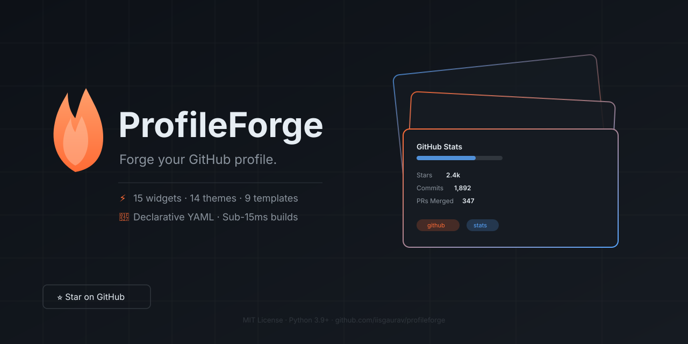

<div align="center">
  
  
  <p>
    <b>A declarative engine that builds stunning, animated GitHub profiles from a single YAML file.</b>
  </p>

  <p>
    <a href="https://github.com/iisgaurav/profileforge/actions"></a>
    <a href="https://pypi.org/project/profileforge/"></a>
    <a href="LICENSE"></a>
    <a href="https://iisgaurav.github.io/profileforge/"></a>
  </p>
</div>

---

### ✨ Why ProfileForge?

Stop copy-pasting fragile SVG snippets! ProfileForge allows you to build a beautiful, personalized developer dashboard in under a minute using a clean, declarative configuration.

* 🎨 **11 Production-Grade Widgets**: From activity timelines to language stats and now-playing components.
* 🚀 **Zero-Install Web Studio**: Build your profile visually directly in your browser.
* ⚡ **Blazing Fast**: Sub-15ms rendering throughput thanks to our decoupled 6-layer architecture.
* 🔄 **CI/CD Ready**: Easily automate profile updates via GitHub Actions.

<br />

<div align="center">
  
</div>

<br />

## 🚀 Quick Start

The fastest way to build your profile is to use **ProfileForge Studio** — our zero-install visual builder that runs entirely in your browser.

<div align="center">
  <a href="https://iisgaurav.github.io/profileforge/">
    
  </a>
</div>

*(Or clone the repo and open `web/index.html` locally!)*

### 💻 CLI Usage

Prefer the terminal? ProfileForge has a powerful CLI for generating SVGs locally or in CI/CD.

```bash
# 1. Install via pip
pip install profileforge

# 2. Scaffold a new profile from a template
profileforge new my-profile --template backend

# 3. Build your SVGs
profileforge build
```

---

## 🎨 Widget Gallery

We have templates and themes for every developer persona. (These are real SVGs generated by ProfileForge!)

<div align="center">

| Identity Banner (`apple`) | GitHub Stats (`aurora`) |
| :---: | :---: |
|  |  |

| Technical Skills (`aurora`) | Activity Timeline (`apple`) |
| :---: | :---: |
|  |  |

| Top Repositories (`apple`) | Developer Focus (`aurora`) |
| :---: | :---: |
|  |  |

</div>

---

## 🧩 Available Widgets

ProfileForge ships with a comprehensive suite of highly customizable widgets:

| Category | Widget ID | Description |
|---|---|---|
| **Identity** | `about` | Bio overview, focal tech stacks, and profile narrative |
| **Stats** | `github_stats` | Stars, PRs, commits, and overall developer ranking score |
| **Stats** | `github_languages` | Top programming languages breakdown with colored bars |
| **Career** | `skills` | Categorized tech skills with curated color badges |
| **Career** | `experience` | Chronological career timeline and roles |
| **Projects** | `repositories` | Featured repos with stars, forks, and language tags |
| **Development** | `roadmap` | Active milestones, progress percentages, and target dates |
| **Development** | `now` | Derek Sivers-style: building, reading, learning, experimenting |
| **Development** | `focus` | Immediate weekly / monthly development priorities |
| **Development** | `activity_timeline` | Colored timeline of recent dev events and contributions |
| **Social** | `social` | Interactive social links, portfolio buttons, and contacts |

---

## ⚙️ GitHub Actions Integration

Keep your profile automatically updated every day by adding this to `.github/workflows/profile.yml`:

```yaml
name: Update Profile SVGs
on:
  schedule:
    - cron: '0 0 * * *' # Runs daily at midnight
  workflow_dispatch:

jobs:
  build:
    runs-on: ubuntu-latest
    steps:
      - uses: actions/checkout@v4
      - name: Set up Python
        uses: actions/setup-python@v5
        with:
          python-version: '3.12'
      - name: Rebuild Profile SVGs
        run: |
          pip install profileforge
          profileforge build
      - name: Commit & Push Changes
        run: |
          git config user.name "github-actions[bot]"
          git config user.email "github-actions[bot]@users.noreply.github.com"
          git add assets/
          git commit -m "chore: refresh profile svgs" || exit 0
          git push
```

---

## 🤝 Contributing & Governance

We welcome contributions from the community! 

* **Documentation**: See `docs/adr/` for Architecture Decision Records.
* **API Stability**: All public API signatures are strictly tracked in `api.lock.json`. 
* **RFCs**: Breaking changes require an approved RFC.
* **Extending**: To add a new widget, subclass `Widget`, implement `build()`, and register it with `@register_widget("my_widget")`.

## 📄 License

ProfileForge is distributed under the [MIT License](LICENSE). © 2026 ProfileForge Team.
