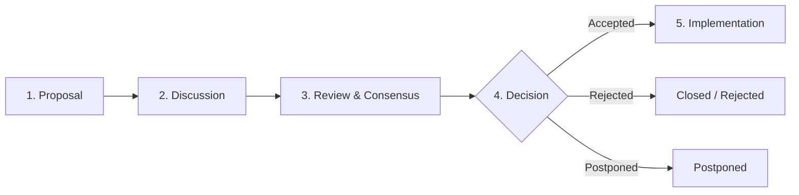

# ProfileForge Request for Comments (RFC) Process

## 1. Overview & Purpose

ProfileForge is committed to maintaining high architectural stability, zero breaking changes to frozen layer APIs without consensus, and a predictable evolution path for users, widget authors, and theme designers.

The **Request for Comments (RFC)** process provides a structured, open, and transparent mechanism for proposing substantial architectural changes, breaking API modifications, and major new features.

---

## 2. When is an RFC Required?

An RFC is **mandatory** for any change that:
1. **Modifies Frozen Core Layer APIs**:
   - Changes to `profileforge.core.models` dataclasses or method signatures.
   - Changes to `profileforge.themes` token schemas or inheritance rules.
   - Changes to `profileforge.components` primitives or `Style` properties.
   - Changes to `profileforge.render.layout` (`LayoutEngine`) calculations or coordinate semantics.
2. **Introduces or Removes Architectural Layers**:
   - Adding a new layer to the 8-layer model or changing unidirectional layer boundary rules.
3. **Modifies the Widget Lifecycle Contract**:
   - Changing hooks or execution flow in `Widget` (`validate`, `resolve_connectors`, `fetch`, `transform`, `build`, `post_build`, `render_safe`).
4. **Changes Configuration File Schemas**:
   - Adding, modifying, or deprecating top-level fields in `profileforge.yaml`.
5. **Introduces New Output Formats or Backends**:
   - Adding new rendering engines (e.g. Canvas, PDF, WebGL).

An RFC is **NOT** required for:
- Bug fixes that restore intended behavior.
- Performance optimizations that preserve identical public API signatures.
- Adding new built-in themes or widgets that conform to existing Layer 2 & Layer 7 contracts.
- Documentation, typos, or developer tooling enhancements.

---

## 3. The RFC Lifecycle

The RFC process follows 5 discrete phases:



### Phase 1: Proposal
1. Submit an initial RFC proposal issue using the GitHub Issue Template: [RFC Proposal](.github/ISSUE_TEMPLATE/rfc_proposal.yml).
2. Fork the repository and create a new branch: `rfc/your-feature-name`.
3. Copy the RFC template below into a new file: `docs/rfcs/YYYY-MM-DD-feature-name.md`.
4. Open a Pull Request with the title: `RFC: <Feature Name>`.

### Phase 2: Community Discussion
1. The PR enters an open discussion period (minimum **14 days**).
2. Maintainers, contributors, and users review the design, raise questions, and discuss trade-offs in the PR discussion thread.
3. The author updates the RFC text to address feedback, resolve edge cases, and refine alternatives.

### Phase 3: Architecture Review & Governance
1. The ProfileForge Core Architecture Team evaluates the proposal against the architectural invariants:
   - Does it violate layer boundaries?
   - Does it introduce heavy external browser/native dependencies?
   - Is it deterministic across GitHub dark and light environments?
   - What is the migration burden for existing users?

### Phase 4: Decision
The Core Team records a formal decision:
- **Accepted**: The RFC is approved and merged into `docs/rfcs/`. The proposal is queued for implementation.
- **Rejected**: The RFC is closed with a clear architectural explanation.
- **Postponed**: The RFC is valid but deferred to a future milestone.

### Phase 5: Implementation & API Snapshot Update
1. The feature is implemented in an implementation PR referencing the accepted RFC.
2. The author updates the API Lock snapshot:
   ```bash
   python tools/api_lock.py --update
   ```
3. Comprehensive test suites (`pytest`), linting (`ruff`), and API checks (`api-lock.yml`) must pass cleanly.
4. The change is released adhering to Semantic Versioning (major bump if breaking).

---

## 4. RFC Document Template

Use the following markdown template when creating an RFC document in `docs/rfcs/`:

```markdown
# RFC: [Short Title of the Proposal]

- **RFC ID**: [YYYY-MM-DD-short-name]
- **Author(s)**: [Your Name / GitHub Handle]
- **Target Layers**: [e.g. Core / Models, Components, Layout]
- **Status**: [Proposed | In Review | Accepted | Rejected | Postponed]
- **Created**: [YYYY-MM-DD]
- **Discussion PR**: [Link to PR]

---

## 1. Summary
A brief 1-2 paragraph executive summary of the proposed change and why it is needed.

## 2. Motivation
- What problem does this solve?
- What use cases does this enable?
- Why can this not be solved with existing abstractions?

## 3. Detailed Design & Technical Specification
- In-depth architectural explanation.
- Proposed data structures, classes, and function signatures.
- Interaction with existing layers and invariants.
- Mermaid diagrams (if applicable).

## 4. Breaking Changes & Migration Strategy
- Is this a breaking change to frozen layer APIs?
- How will existing widgets, themes, and configuration files migrate?
- Deprecation schedule (warnings in minor releases before removal).

## 5. Drawbacks & Trade-offs
- What are the potential downsides of this approach?
- Impact on performance, memory, or bundle size.

## 6. Alternatives Considered
- What alternative approaches were evaluated and why were they rejected?

## 7. Unresolved Questions & Future Work
- What open questions remain for discussion during the RFC review window?
```
