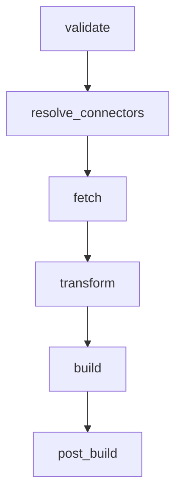

# ProfileForge Widget Authoring Guide

This guide documents the ProfileForge Widget Platform, the standardized widget lifecycle, metadata specifications, failure isolation mechanisms, and step-by-step instructions for authoring new widgets.

---

## 1. Overview

ProfileForge widgets are modular, declarative UI components that ingest data from connectors (e.g., local files, GitHub GraphQL API) and render structured SVG cards into developer profiles.

Every widget in ProfileForge inherits from the `Widget` base class and adheres to:
1. **Strong Metadata Specifications (`WidgetMetadata`)**: Defines identity, categorization, versioning, and dependencies.
2. **Standard 6-Phase Lifecycle**: Cleanly separates validation, connector resolution, data retrieval, transformation, UI building, and post-processing.
3. **Failure Isolation (`render_safe`)**: Guarantees that any runtime or upstream connector error is isolated to that widget and replaced with a diagnostic fallback Card, without crashing the overall profile generation pipeline.

---

## 2. Widget Metadata

Every widget must implement `metadata() -> WidgetMetadata`.

```python
from profileforge.widgets.base import WidgetCategory, WidgetMetadata


def metadata(self) -> WidgetMetadata:
    return WidgetMetadata(
        id="github_stats",
        name="GitHub Stats",
        category=WidgetCategory.STATS,
        description="Displays aggregated repository stats, PRs, commits, and score.",
        version="1.0.0",
        author="ProfileForge Team",
        license="MIT",
        schema=1,
        tags=["github", "stats", "metrics"],
        required_connectors=["github"],
        experimental=False,
        deprecated=False,
    )
```

### `WidgetMetadata` Fields

| Field | Type | Default | Description |
|---|---|---|---|
| `id` | `str` | Required | Unique slug identifier for the widget (e.g. `"about"`, `"github_stats"`). |
| `name` | `str` | Required | Human-readable display name. |
| `category` | `str` | Required | Categorization from `WidgetCategory`. |
| `description` | `str` | `""` | Brief description of widget purpose and features. |
| `version` | `str` | `"1.0.0"` | Semantic version string. |
| `author` | `Optional[str]` | `None` | Author or team maintaining the widget. |
| `license` | `str` | `"MIT"` | License identifier. |
| `schema` | `int` | `1` | Configuration schema version. |
| `tags` | `list[str]` | `[]` | Search and taxonomy tags. |
| `required_connectors` | `list[str]` | `[]` | List of connectors required (e.g., `["github"]`, `["local"]`). |
| `experimental` | `bool` | `False` | Flags experimental/unstable widgets. |
| `deprecated` | `bool` | `False` | Flags deprecated widgets slated for retirement. |

### `WidgetCategory` Constants

Widgets belong to standard categories:
- `WidgetCategory.IDENTITY` (`"identity"`): Hero banners, about summaries, bio cards.
- `WidgetCategory.STATS` (`"stats"`): GitHub statistics, language analytics, metric summaries.
- `WidgetCategory.PROJECTS` (`"projects"`): Showcased repositories, pins, open-source work.
- `WidgetCategory.CAREER` (`"career"`): Work history, technical skills, certifications.
- `WidgetCategory.DEVELOPMENT` (`"development"`): Roadmaps, active goals, learning trajectories.
- `WidgetCategory.CONTENT` (`"content"`): Blog posts, RSS feeds, media feeds.
- `WidgetCategory.SOCIAL` (`"social"`): Social links, community memberships.
- `WidgetCategory.UTILITY` (`"utility"`): Clocks, quotes, system diagnostics.

---

## 3. The 6-Phase Lifecycle Architecture

The `Widget` base class provides distinct lifecycle hooks called sequentially during rendering:



### 1. `validate(self, context: BuildContext) -> None`
- Validates that prerequisites, configuration values, and execution contexts are satisfied.
- Raise an exception if preconditions fail.

### 2. `resolve_connectors(self, context: BuildContext) -> dict[str, Any]`
- Looks up required connectors in `context.services.connectors`.
- Default implementation automatically queries `required_connectors` defined in `metadata()`.

### 3. `fetch(self, context: BuildContext) -> Any`
- Ingests raw data from connectors, disk, or remote APIs.
- Keep this method purely focused on I/O. Do not perform UI rendering here.

### 4. `transform(self, data: Any, context: BuildContext) -> Any`
- Cleans, parses, calculates metrics, and structures raw data for presentation.
- Decouples raw API payloads from layout components.

### 5. `build(self, data: Any, context: BuildContext) -> Component`
- Pure UI building hook.
- Constructs the declarative layout tree using ProfileForge components (`Card`, `Column`, `Row`, `Wrap`, `Text`, `Badge`, `ProgressBar`, `MetricGroup`, etc.).

### 6. `post_build(self, component: Component, context: BuildContext) -> Component`
- Optional post-processing hook for layout overrides, responsive adjustments, or wrapping.
- Returns the final `Component` tree.

---

## 4. Failure Isolation (`render_safe`)

ProfileForge protects profile builds against network outages, missing local files, or unexpected data schemas using `render_safe(context: BuildContext)`:

```python
component_tree = widget.render_safe(context)
```

If any phase in the lifecycle raises an unhandled exception:
1. The error is captured without aborting the CLI or remaining widgets.
2. `_create_fallback()` generates a standardized fallback `Card`.
3. The fallback displays:
   - **Title**: `Error: {Widget Name}`
   - **Error Message**: Diagnostic details and reason.
   - **Connector Diagnostics**: Required connectors and status.

---

## 5. Step-by-Step Authoring Guide

### Step 1: Create the Widget Module
Create a new Python file in `src/profileforge/widgets/` (or within a plugin package).

### Step 2: Inherit from `Widget` and Register
Use the `@register_widget("slug")` decorator.

```python
from typing import Any
from profileforge.components.layout import Column, Component, Padding
from profileforge.components.style import Style
from profileforge.components.widgets import Card, Text
from profileforge.core.context import BuildContext
from profileforge.core.models import DataRequest
from profileforge.core.registry import register_widget
from profileforge.widgets.base import Widget, WidgetCategory, WidgetMetadata


@register_widget("project_spotlight")
class ProjectSpotlightWidget(Widget):
    def metadata(self) -> WidgetMetadata:
        return WidgetMetadata(
            id="project_spotlight",
            name="Project Spotlight",
            category=WidgetCategory.PROJECTS,
            description="Highlights featured open-source repositories.",
            version="1.0.0",
            author="Your Name",
            tags=["projects", "showcase", "open-source"],
            required_connectors=["local"],
        )

    def fetch(self, context: BuildContext) -> Any:
        connector = context.services.connectors.get("local")
        request = DataRequest(resource="projects.yaml")
        return connector.fetch(request) if connector else []

    def transform(self, data: Any, context: BuildContext) -> list[dict[str, Any]]:
        if not isinstance(data, list):
            return []
        return [
            {
                "name": item.get("name", "Untitled Project"),
                "description": item.get("description", ""),
                "stars": item.get("stars", 0),
            }
            for item in data
        ]

    def build(self, data: Any, context: BuildContext) -> Component:
        items = data or []
        rows = []
        for p in items:
            rows.append(
                Text(
                    f"⭐ {p['name']} - {p['description']}",
                    style=Style(font_size=13, color="text"),
                )
            )

        content = Column(children=rows, spacing=8, style=Style(width="fill"))
        return Card(
            title="Featured Projects",
            child=Padding(child=content, value=20, style=Style(width="fill")),
            style=Style(width=820, elevation="medium", variant="solid"),
        )
```

### Step 3: Register in CLI & Tests
Ensure the module is imported in `profileforge.cli.main` or dynamically loaded via plugins, and add unit tests in `tests/test_widgets.py`.

---

## 6. Best Practices

- **Never hardcode styles**: Use design tokens from `context.theme.colors`, `context.theme.spacing`, etc., or semantic names like `"text"`, `"muted"`, `"primary"`.
- **Pure `build()`**: Keep `build(data, context)` free of network calls or disk I/O.
- **Support graceful fallbacks**: Handle empty data collections or missing optional fields smoothly in `transform()`.
- **Unit test lifecycle**: Verify that `render_safe()` handles empty context and malformed inputs gracefully.
