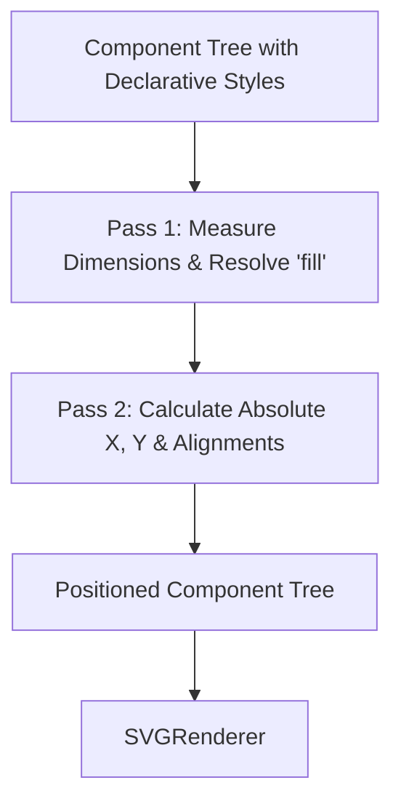

# ADR-003: Two-Pass Flexbox & Grid Layout Engine for SVG

## Status
**Accepted** (2026-08-02)

## Context & Problem Statement
Rendering rich, dynamic UI layouts in SVG for GitHub profile readmes poses unique technical challenges:
1. **GitHub SVG Sanitization**: GitHub renders embedded profile images via `` tags, which strip all HTML `<foreignObject>` tags, interactive JavaScript, and external web fonts/stylesheets for security.
2. **Lack of Native CSS Flow**: Standard SVG does not natively support CSS Flexbox or CSS Grid layout algorithms without `<foreignObject>`. All `<rect>`, `<text>`, and `<g>` elements require explicit absolute pixel coordinates `(x, y)` and bounding dimensions `(width, height)`.
3. **Variable Content Dynamics**: Text strings, usernames, repository descriptions, and badge collections vary in length dynamically. Fixed hardcoded coordinates result in overlapping text or broken layouts.
4. **External Dependency Constraints**: Utilizing a full browser engine (e.g. headless Chrome, Cairo, or WeasyPrint) adds hundreds of megabytes of binary dependencies, slows build times, and complicates cross-platform deployment on developer machines.

## Decision
We decided to build a **Custom Two-Pass Deterministic Flex & Grid Layout Engine** (`LayoutEngine` in Layer 4) implemented in pure Python with zero external dependencies.

Key elements of this decision:
1. **Pass 1: Intrinsic Measurement & Relative Sizing**:
   - Recursively traverses the `Component` tree.
   - Measures content dimensions (estimating character metrics for `Text`, intrinsic dimensions for `Badge`, `Icon`, `ProgressBar`).
   - Resolves `width="fill"` or `height="fill"` relative to parent container constraints.
2. **Pass 2: Absolute Coordinate Assignment & Alignment**:
   - Computes exact `(computed_x, computed_y)` coordinates for every node.
   - Computes cross-axis alignment (`align="start"`, `align="center"`, `align="end"`) and main-axis justification (`justify="center"`, `justify="end"`).
   - Handles multi-row wrapping in `Wrap` containers by tracking `spacing` and `run_spacing`.
   - Propagates coordinate shifts recursively via `LayoutEngine.shift(component, dx, dy)`.
3. **Pure Separation of Concerns**:
   - The layout engine outputs mutated `computed_*` properties on components and does not emit SVG strings.

## Consequences

### Positive
- **100% Deterministic Output**: SVGs render identically across all browsers, mobile GitHub apps, and dark/light modes.
- **Zero Binary Dependencies**: Runs instantly on Python 3.9+ without needing external C libraries, Cairo, or headless Chromium.
- **High Performance**: Computes full layout trees in under 5 milliseconds.
- **Clean Architecture**: Decouples geometric calculation from SVG XML rendering.

### Negative / Trade-offs
- **Approximated Font Metrics**: Because font rendering varies slightly by client OS typography rendering engines, character width estimation must include safe padding buffers.
- **Subset of CSS Flexbox**: Only flexbox and grid features essential to ProfileForge cards are implemented (avoiding unnecessary complexity of the full CSS specification).
