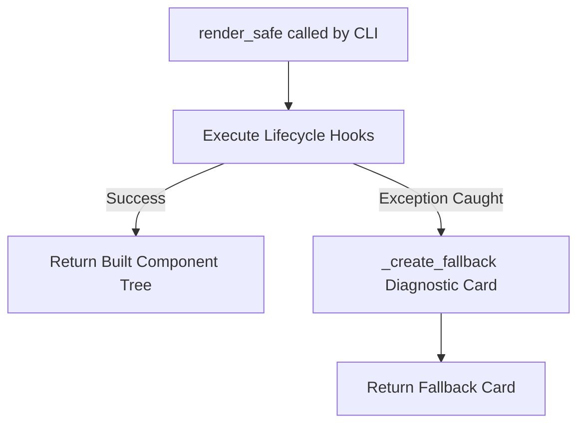

# ADR-005: Standard Widget Lifecycle and Failure Isolation Mechanism

## Status
**Accepted** (2026-08-02)

## Context & Problem Statement
A typical ProfileForge profile or dashboard orchestrates multiple independent widgets (e.g. Identity bio, GitHub Stats, Top Languages, Roadmap, Career Timeline).

In real-world developer environments:
1. An upstream API might fail (e.g., GitHub API rate limit reached, temporary DNS timeout).
2. A local configuration file might have missing optional keys or a malformed YAML structure.
3. A third-party community widget might contain an unhandled exception or edge case.

If any single widget throwing an exception crashes the entire CLI build:
- The user's entire GitHub profile breaks or fails to generate.
- Automated CI workflows (e.g. nightly profile cron update actions) fail loudly.
- Users receive opaque tracebacks rather than actionable diagnostics.

## Decision
We decided to standardize a **6-Phase Widget Lifecycle** with an automatic **Failure Isolation Boundary (`render_safe`)** in the `Widget` base class (Layer 7).

Key elements of this decision:
1. **6-Phase Lifecycle Hooks**:
   - `validate(context)`: Pre-execution prerequisite checks.
   - `resolve_connectors(context)`: Looks up required connectors declared in `WidgetMetadata`.
   - `fetch(context)`: Connector I/O retrieval.
   - `transform(raw_data, context)`: Pure data normalization and metric computation.
   - `build(data, context)`: Declarative component construction.
   - `post_build(component, context)`: Optional visual post-processing.
2. **Failure Isolation Orchestrator (`render_safe`)**:
   - The CLI always invokes `widget.render_safe(context)`.
   - If any lifecycle phase raises an exception, `render_safe()` catches the error and executes `_create_fallback(context, error)`.
3. **Graceful Fallback Diagnostic Card**:
   - Emits a standardized `Card` displaying:
     - The widget name.
     - The exact diagnostic error message.
     - The required connector dependencies and status.
   - The fallback card respects active theme styling and maintains valid SVG layout dimensions.

## Consequences

### Positive
- **Fault-Tolerant Profile Generation**: Profile builds always succeed. One failed widget does not prevent other valid widgets from rendering.
- **Actionable Developer Feedback**: Users and widget authors immediately see clear diagnostic cards in their generated preview rather than broken builds.
- **Consistent Authoring Model**: Widget developers follow a clear, structured sequence separating data acquisition, transformation, and UI building.

### Negative / Trade-offs
- **Silent Failures in Production**: If an error occurs, the profile renders a fallback card instead of throwing a non-zero exit code in CI unless explicitly run in strict validation mode (`profileforge validate`).
