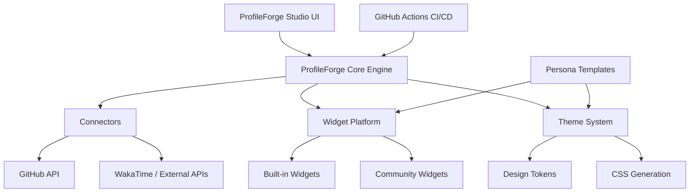

# ProfileForge Ecosystem

ProfileForge is more than just a script; it is a complete, declarative ecosystem for generating developer profiles and SVG widgets. 

## The Layers

- **Core Engine**: The foundational Python library and CLI (`profileforge build`) that parses YAML, orchestrates data fetching, and renders SVGs.
- **Widget Platform**: 15 built-in widgets (hero, streak, github_stats, etc.) plus an interface for community widgets.
- **Theme System**: 14 official themes (github-dark, catppuccin variants, etc.) with a CSS-variable based token system.
- **Template Gallery**: 9 persona-driven templates (e.g., ai-engineer, frontend) acting as turnkey solutions.
- **Connector Framework**: Adapters that fetch data from external sources (GitHub GraphQL, REST APIs, local git state).
- **ProfileForge Studio**: A visual, no-code builder running locally at `web/index.html`.
- **CI/CD Integration**: Pre-built GitHub Actions to automatically update your profile daily.

## Future Ecosystem Additions

- **Community Registry**: A decentralized registry for sharing custom widgets and themes.
- **Marketplace**: Browse and rate community creations.
- **Cloud-hosted Service**: OAuth login for zero-setup deployments.

## Architecture Diagram

